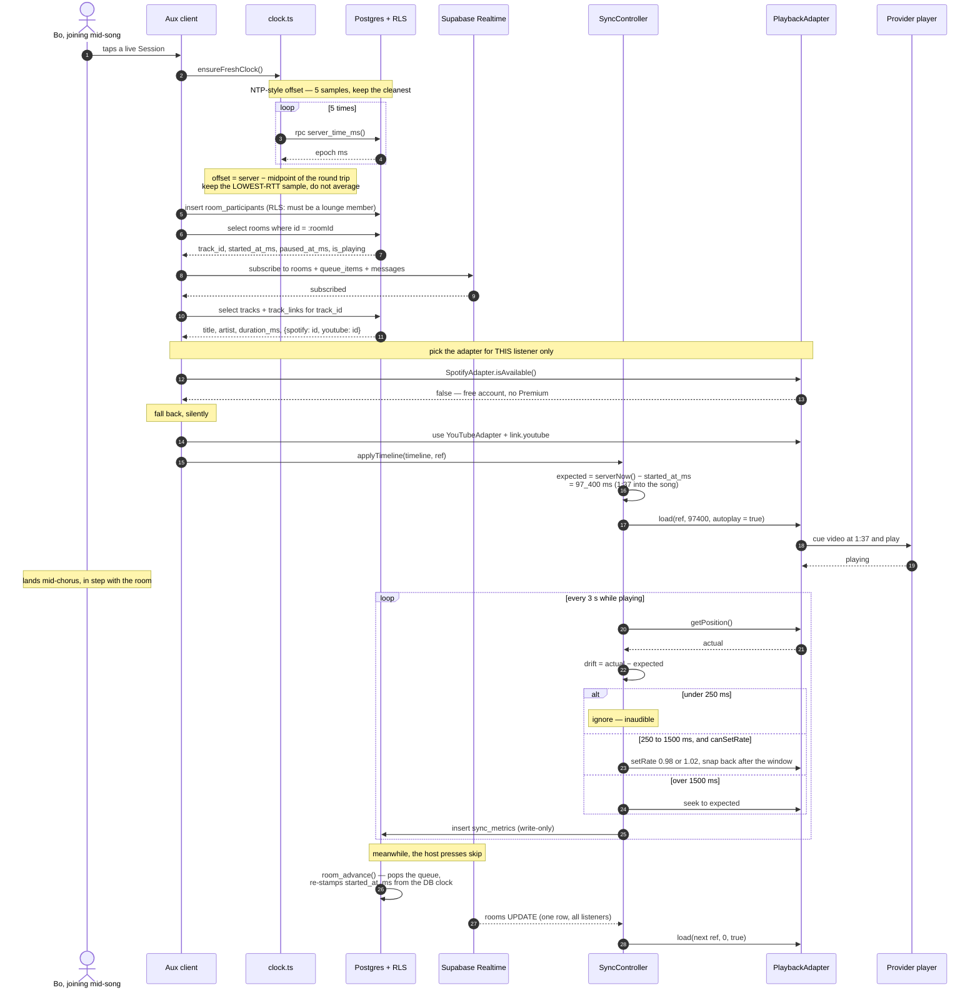

# Aux — Architecture

> **The whole system in one sentence:**
> the server owns *time*, the client owns *the player*.

Everything else in this document is a consequence of that sentence.

---

## 1. The core principle

The naive way to build synchronized listening is to stream audio from a server and have every client
consume the same stream. That is also the way to make the project impossible: you would need audio
licensing you cannot get, bandwidth you cannot afford, and a transport whose latency you would then
have to correct for anyway.

Aux inverts it. **No audio ever passes through the backend.** Each listener plays the song locally,
on their own device, from their own Spotify or YouTube session. What the backend distributes is not
sound — it is a **timeline**: one row saying *which track*, and *the server instant at which position
zero of that track played*.

```
supabase/migrations/20260821000200_music_and_rooms.sql

  create table public.rooms (
    ...
    track_id      uuid references public.tracks(id) on delete set null,
    started_at_ms bigint,
    paused_at_ms  bigint,
    is_playing    boolean not null default false,
    ...
  );
```

That is roughly 40 bytes of state. A play, a pause, a seek and a skip are all a **single `UPDATE` to
a single row**, which Realtime fans out to every listener. There is no per-listener message, no
per-tick heartbeat, no stream.

The consequences are worth naming explicitly:

- **It is free to run.** The entire live experience fits inside a Supabase free tier, because the
  data plane carries JSON the size of a tweet and the audio plane never touches our infrastructure.
- **It is legal.** We do not host, cache, transcode or redistribute anyone's music. Spotify plays
  through Spotify; YouTube plays through YouTube's own embedded player. Aux coordinates; it does not
  serve.
- **A late joiner is not a special case.** If your position is derived from the row rather than
  pushed to you, then joining mid-song is exactly the same arithmetic as being there from the start.
  There is no "catch-up" code path because there is nothing to catch up *to*.
- **A dropped connection self-heals.** A client that misses ten updates and then reconnects reads the
  current row and lands correctly. State is a value, not an event log, so missed events cost nothing.
- **The system degrades gracefully.** If Realtime is slow, listeners are late to a *change*, but
  never wrong about the *timeline* once it arrives.

The price is that the backend cannot enforce what a client actually plays. A listener could mute
themselves or scrub away and the server would not know. Aux treats sync as a service to a cooperating
client, not as DRM — which is the right trade for a party app.

---

## 2. Architecture at a glance

```
   CONTROL PLANE  — tiny JSON, ours          AUDIO PLANE — never touches our servers
   ══════════════════════════════════        ══════════════════════════════════════

  ┌─ DEVICE A ─ Spotify Premium ────┐        ┌─ DEVICE B ─ free, falls back ───┐
  │                                 │        │                                 │
  │  expo-router screens            │        │  expo-router screens            │
  │  react-query  +  zustand        │        │  react-query  +  zustand        │
  │             │                   │        │             │                   │
  │             ▼                   │        │             ▼                   │
  │  ┌───────────────────────────┐  │        │  ┌───────────────────────────┐  │
  │  │      SyncController       │  │        │  │      SyncController       │  │
  │  │  expected vs actual, 3s   │  │        │  │  expected vs actual, 3s   │  │
  │  └───────────┬───────────────┘  │        │  └───────────┬───────────────┘  │
  │              ▼                  │        │              ▼                  │
  │  ┌───────────────────────────┐  │        │  ┌───────────────────────────┐  │
  │  │ PlaybackAdapter interface │  │        │  │ PlaybackAdapter interface │  │
  │  │   → SpotifyAdapter        │  │        │  │   → YouTubeAdapter        │  │
  │  │   canSetRate: false       │  │        │  │   canSetRate: true        │  │
  │  │   hasLocalPosition: false │  │        │  │   hasLocalPosition: true  │  │
  │  └───────────┬───────────────┘  │        │  └───────────┬───────────────┘  │
  │              │                  │        │              │                  │
  │  ┌───────────▼───────────────┐  │        │  ┌───────────▼───────────────┐  │
  │  │  🔊 Spotify app / device  │  │        │  │  🔊 YT IFrame in WebView  │  │
  │  └───────────────────────────┘  │        │  └───────────────────────────┘  │
  └────────────┬────────────────────┘        └────────────┬────────────────────┘
               │                                          │
               │   read timeline / call host RPCs         │
               └──────────────────┬───────────────────────┘
                                  ▼
  ┌──────────────────────────── SUPABASE ─────────────────────────────────────┐
  │                                                                           │
  │  REALTIME    rooms · room_participants · queue_items · messages           │
  │              one UPDATE to `rooms` = the entire fan-out                   │
  │                    ▲                                                      │
  │  POSTGRES + RLS    │                                                      │
  │    rooms(track_id, started_at_ms, paused_at_ms, is_playing) ← the truth   │
  │    tracks / track_links  ← one song, N provider ids                       │
  │    queue_items (fractional `position` for O(1) reorder)                   │
  │    lounges / lounge_members / messages / reactions / sync_metrics         │
  │                                                                           │
  │    server_time_ms()          ← the authoritative clock                    │
  │    room_play · room_pause · room_resume · room_seek · room_advance        │
  │    queue_append · join_lounge_by_code       (all SECURITY DEFINER)        │
  │                                                                           │
  │  EDGE FUNCTIONS (service role — the only readers of provider_tokens)      │
  │    spotify-auth  ──► PKCE exchange + refresh ──► provider_tokens          │
  │    spotify-api   ──► search + /me/player/* on the caller's behalf         │
  │    resolve-track ──► cross-provider matching ──► tracks + track_links     │
  │                                                                           │
  │  provider_tokens   RLS enabled · ZERO policies · unreachable from the app │
  └───────────────────────────────────────────────────────────────────────────┘
```

Note what is *not* in that diagram: any arrow carrying audio into or out of Supabase. That absence is
the architecture.

---

## 3. The clock

### 3.1 Why an offset is needed at all

Every client computes its own position from `rooms.started_at_ms`, which is an absolute epoch
timestamp stamped by the **database** clock. To use it, a client must be able to answer "what time is
it *on the server* right now?"

`Date.now()` cannot answer that. Consumer device clocks are routinely wrong — by hundreds of
milliseconds from NTP jitter, by whole seconds on devices that have not synced recently, by *minutes*
on a phone with a manually-set clock or a stale timezone database, and by hours on an emulator that
has been suspended. An error that would be invisible in almost any other app is, here, directly
audible: a device whose clock is 2 seconds fast will play every song 2 seconds ahead of the room,
forever, and no amount of drift correction will help — because from that device's point of view it is
perfectly on time.

So Aux never trusts `Date.now()` as an absolute. It measures how wrong it is, once, and corrects.

### 3.2 How the offset is measured

`src/lib/clock.ts` implements a small NTP:

```ts
const t0 = Date.now();
const { data, error } = await supabase.rpc('server_time_ms');
const t1 = Date.now();

const rttMs = t1 - t0;
// Assume the request and response legs are symmetric, so the server's
// timestamp corresponds to the midpoint of our round trip.
const midpoint = t0 + rttMs / 2;

return { offsetMs: Number(data) - midpoint, rttMs };
```

The server-side half is deliberately trivial, so it costs nothing and cannot itself introduce delay:

```sql
create or replace function public.server_time_ms()
returns bigint
language sql stable
as $$
  select (extract(epoch from clock_timestamp()) * 1000)::bigint;
$$;
```

(`clock_timestamp()` and not `now()` — `now()` is the transaction start time and would be pinned for
the whole statement, which is exactly the wrong semantics for a clock.)

Every read of server time then goes through:

```ts
export function serverNow(): number {
  return Date.now() + offsetMs;
}
```

### 3.3 Why lowest-RTT beats averaging

Five samples are taken (`SAMPLE_COUNT = 5`) and then:

```ts
// Lowest RTT wins outright rather than averaging: a single clean sample
// beats a mean polluted by one slow request on a mobile network.
const best = samples.reduce((a, b) => (b.rttMs < a.rttMs ? b : a));
```

The estimator assumes the outbound and return legs of the round trip take the same time, so the
server's timestamp corresponds to `t0 + rtt/2`. **The error in that assumption is bounded by the
asymmetry of the round trip, which is itself bounded by the RTT.** A 20 ms round trip can be wrong by
at most ~10 ms. A 400 ms round trip can be wrong by up to ~200 ms.

That is why the samples are not equally good, and why averaging is the wrong move:

- Network delay is not symmetric noise around a true value. It is a **floor plus a one-sided tail** —
  you can never be faster than the speed of light and the routing path, but you can be arbitrarily
  slower because of a retransmit, a radio wake-up, a scheduler hiccup, or a captive-portal DNS stall.
  The distribution has a hard left edge and a long right tail.
- Averaging over that distribution pulls the estimate *toward the tail*. One 900 ms sample on a
  mobile network moves a mean of five by 150 ms, and there is nothing on the other side to cancel it.
- The lowest-RTT sample is the one that came closest to the physical floor, which is precisely the
  sample whose symmetry assumption is most defensible. It is the *least contaminated* observation,
  not merely a cheap one.

This is the same reasoning NTP uses when it prefers the minimum-delay sample from a burst rather than
the mean. A median would also be defensible and more robust to a freak *fast* sample; the minimum is
chosen here because a spuriously fast round trip is essentially impossible, while spuriously slow
ones are routine on the exact networks the app runs on.

### 3.4 Freshness and concurrency

```ts
const STALE_AFTER_MS = 60_000;
```

Offsets go stale — the device clock can be corrected by the OS mid-session, and crystal drift is real
over long sessions. `ensureFreshClock()` re-measures only when the last sample is over a minute old,
which is called on room join, app foreground and network reconnect.

Concurrent callers share one in-flight measurement:

```ts
let inFlight: Promise<number> | null = null;
export async function syncClock(): Promise<number> {
  if (inFlight) return inFlight;
  ...
}
```

Without this, a room join, an app foreground and the periodic timer landing together would fire
fifteen RPCs and produce three racing writes to a module-level variable.

**Failure mode worth knowing:** if every sample fails, `offsetMs` keeps its previous value —
initially `0`, i.e. "trust the device clock". That is the correct fallback (a device with a good
clock still works), but it means a completely unreachable `server_time_ms` degrades silently into
raw `Date.now()` rather than erroring. If a whole room is uniformly out of sync, check that RPC
first.

---

## 4. The sync math

### 4.1 The formula

From the header of `src/playback/sync-controller.ts`:

```
expected = server_now   - started_at_ms     while playing
expected = paused_at_ms - started_at_ms     while paused
```

and the implementation:

```ts
export function expectedPositionMs(timeline: RoomTimeline, nowMs = serverNow()): number {
  if (timeline.startedAtMs == null) return 0;

  const anchor = timeline.isPlaying ? nowMs : (timeline.pausedAtMs ?? nowMs);
  return Math.max(0, anchor - timeline.startedAtMs);
}
```

`started_at_ms` is not "when the host pressed play". It is **the instant at which position zero of
this track would have played**, which is a different and much more useful thing — it stays a valid
anchor through seeks and pauses.

### 4.2 Why every mutation is a server-side RPC

The client is never allowed to compute a timeline, because a client with a wrong clock would write a
wrong anchor and desync *everyone*. Every operation that establishes an anchor is a `SECURITY
DEFINER` function that stamps the time from the database:

**Play at an offset** — subtract the offset from now, so the anchor is "when zero *would* have been":

```sql
update public.rooms
set track_id      = p_track_id,
    started_at_ms = public.server_time_ms() - greatest(p_position_ms, 0),
    paused_at_ms  = null,
    is_playing    = true
where id = p_room_id
```

**Pause** — freeze by recording the moment:

```sql
set paused_at_ms = public.server_time_ms(), is_playing = false
```

The anchor is untouched, so `paused_at_ms - started_at_ms` keeps yielding the frozen position for as
long as the room stays paused.

**Resume** — slide the anchor forward by exactly the paused duration, so the frozen position is
preserved:

```sql
set started_at_ms = started_at_ms + (public.server_time_ms() - paused_at_ms),
    paused_at_ms  = null,
    is_playing    = true
```

**Seek** — re-anchor, and re-freeze if the room was paused:

```sql
set started_at_ms = public.server_time_ms() - greatest(p_position_ms, 0),
    paused_at_ms  = case when is_playing then null else public.server_time_ms() end
```

The `case` is load-bearing. Seeking while paused must produce `paused_at_ms - started_at_ms =
p_position_ms`, which only holds if both are stamped from the same instant.

`room_pause` and `room_resume` are also written to be **idempotent**: their `UPDATE` is guarded
(`where ... and is_playing`), and when it matches nothing they re-select and return the row unchanged
rather than raising. A double-tapped pause button is a no-op, not an error toast.

A `CHECK` constraint keeps the invariant honest at the storage layer:

```sql
constraint rooms_playing_needs_track check (
  not is_playing or (track_id is not null and started_at_ms is not null)
)
```

A playing room *cannot* exist without knowing what it is playing and since when.

### 4.3 Applying a timeline

`SyncController.applyTimeline()` is called on every Realtime update. Three details matter:

**Identical timelines are ignored.** A chatty channel (a participant joining, a queue reorder) must
not cause a seek storm, so a structural comparison short-circuits before any player call:

```ts
const sameTimeline = (a: RoomTimeline | null, b: RoomTimeline) =>
  a !== null &&
  a.trackId === b.trackId &&
  a.startedAtMs === b.startedAtMs &&
  a.pausedAtMs === b.pausedAtMs &&
  a.isPlaying === b.isPlaying;
```

**Overlapping applies are serialized.** Loading a track is a network round trip; a second update
arriving mid-load would interleave its seeks with the first one's. An `applying` flag guards the
critical section — and the `finally` block re-runs if a newer timeline landed while awaiting, so the
controller converges on the *latest* state rather than the one it started with.

**Position reads are extrapolated for remote players.** `getPosition()` on Spotify is a rate-limited
Web API call, so the controller keeps `lastKnown = { positionMs, atMs }` and does the arithmetic
itself between real reads:

```ts
return this.lastKnown.positionMs + (serverNow() - this.lastKnown.atMs);
```

---

## 5. The drift ladder

Being anchored correctly is not the same as *staying* correct. Players drift: audio hardware clocks
differ from system clocks, a WebView throttles when backgrounded, a YouTube ad interrupts, a Bluetooth
codec buffers, a network hiccup stalls a buffer.

Every 3 seconds (`Drift.CHECK_INTERVAL_MS`), the controller compares reality to the timeline:

```ts
const expected = expectedPositionMs(this.timeline);
const drift = actual - expected;   // positive = we are ahead
const magnitude = Math.abs(drift);
```

The response is a three-rung ladder, defined in `src/playback/types.ts`:

```ts
export const Drift = {
  IGNORE: 250,
  SEEK: 1_500,
  RATE_NUDGE: 0.02,
  CHECK_INTERVAL_MS: 3_000,
  REMOTE_POLL_INTERVAL_MS: 10_000,
} as const;
```

| Drift | Rung | Action | Why |
| --- | --- | --- | --- |
| `< 250 ms` | **ignore** | nothing | Below the threshold at which two people in a room notice they are out of step, and well inside the error bars of the measurement itself. Correcting it would be *more* disruptive than the error — you would be introducing an audible artifact to fix an inaudible one. |
| `250 ms – 1500 ms` | **nudge** | play at ×0.98 or ×1.02 until the gap closes, then snap back to 1.0 | Audible enough to matter, small enough to hide. A 2% rate change is a ~35-cent pitch shift, below the threshold most listeners detect on music they are not concentrating on. The gap closes *continuously* and nobody hears a discontinuity. |
| `> 1500 ms` | **seek** | hard `seek(expected)` | Too far gone to hide. Absorbing 1.5 s at 2% would take 75 seconds of playback — longer than the mistake would remain relevant. Take the audible skip and land exactly. |

```ts
if (magnitude > Drift.SEEK) {
  action = 'seek';
  await this.adapter.seek(expected);
  this.lastKnown = { positionMs: expected, atMs: serverNow() };
} else if (magnitude > Drift.IGNORE && this.adapter.capabilities.canSetRate) {
  action = 'nudge';
  await this.adapter.setRate(1 + (drift > 0 ? -Drift.RATE_NUDGE : Drift.RATE_NUDGE));

  const correctionMs = Math.min((magnitude / Drift.RATE_NUDGE) * 1.2, Drift.CHECK_INTERVAL_MS);
  ...
}
```

Three honest notes about the middle rung:

1. **The nudge is deliberately slow.** `(magnitude / RATE_NUDGE) * 1.2` is `magnitude × 60` — closing
   300 ms "properly" would need 18 seconds of nudging — but it is clamped to one check interval. So a
   single nudge window erases at most `3000 × 0.02 = 60 ms`. Larger gaps in this band converge over
   several 3-second cycles rather than in one. That is the intended behavior: inaudibility is the
   whole point of this rung, and anything genuinely urgent is above `SEEK` anyway.
2. **The nudge rung requires `canSetRate`, and Spotify does not have it.** A Spotify listener drifting
   by, say, 800 ms gets `action: 'none'` and simply rides it until it crosses 1500 ms and gets
   seeked. This is a real capability gap, not an oversight — the Spotify Web API exposes no playback
   rate control. It is also why the `canSetRate` check lives in the *capability*, not in a
   `provider === 'spotify'` branch.
3. **Polling frequency is capability-driven too.** A local player is asked directly every tick; a
   remote one is asked at most every `REMOTE_POLL_INTERVAL_MS` (10 s) and extrapolated in between:

   ```ts
   const shouldPoll =
     this.adapter.capabilities.hasLocalPosition ||
     !this.lastKnown ||
     serverNow() - this.lastKnown.atMs > Drift.REMOTE_POLL_INTERVAL_MS;
   ```

Every measurement is reported through `onDrift(driftMs, action)`, which feeds both the "in sync"
badge in the UI and the `sync_metrics` table. That table exists so the claim "Aux stays in sync" is a
number you can query, not an anecdote.

A failed position poll is swallowed (`catch { return; }`) — one missed sample is not worth an error
toast, and the next tick retries three seconds later.

---

## 6. Joining a Session mid-song

This is the flow that best demonstrates the architecture, because *there is no special code for it*.
The joiner runs the same three steps every client runs: sync the clock, read the row, do the
arithmetic.



Steps 3–9 in that diagram are the *entire* join. There is no negotiation, no buffering handshake, no
"waiting for host" state. Bo's client answers "where should I be?" locally and goes there.

---

## 7. The adapter seam

### 7.1 The contract

`SyncController` never mentions Spotify or YouTube. It talks only to `PlaybackAdapter`
(`src/playback/types.ts`):

```ts
export interface PlaybackAdapter {
  readonly provider: MusicProvider;
  readonly capabilities: AdapterCapabilities;

  isAvailable(): Promise<boolean>;
  load(ref: PlayableRef, positionMs: number, autoplay: boolean): Promise<void>;
  play(): Promise<void>;
  pause(): Promise<void>;
  seek(positionMs: number): Promise<void>;
  getPosition(): Promise<number>;
  setVolume(volume: number): Promise<void>;
  setRate(rate: number): Promise<void>;
  unload(): Promise<void>;
  onEnded(listener: () => void): () => void;
  onError(listener: (error: PlaybackError) => void): () => void;
}
```

The important design choice is that **the controller branches on capabilities, never on provider
name**:

```ts
export type AdapterCapabilities = {
  canSetRate: boolean;        // YouTube can, Spotify cannot
  hasLocalPosition: boolean;  // false for Spotify — getPosition() is a rate-limited HTTP call
  canSetVolume: boolean;      // reserved for ducking music under push-to-talk
};
```

If the sync engine said `if (provider === 'spotify')`, every new provider would mean editing the most
delicate code in the app. Because it says `if (adapter.capabilities.canSetRate)`, a new provider is a
new file that declares what it can do. The sync engine never learns it exists.

`isAvailable()` is the other half of that decoupling. It answers "can *this user, right now*, use
this adapter?" — for Spotify that means a linked, whitelisted, Premium account with an active device;
for YouTube it is effectively always true. Adapter selection is a runtime query, not a stored
preference, which is why the fallback is invisible to the user.

### 7.2 How one Session mixes providers

Here is the part that surprises people: **there is no server-side notion of which provider a Session
uses.** The `rooms` row stores a `track_id` — a row in the source-agnostic `tracks` table. It does not
store a Spotify URI or a YouTube video id.

```sql
create table public.tracks (
  id uuid primary key default gen_random_uuid(),
  title text not null,
  artist text not null,
  album text,
  duration_ms integer not null check (duration_ms > 0),
  isrc text,
  artwork_url text,
  ...
);

create table public.track_links (
  track_id    uuid not null references public.tracks(id) on delete cascade,
  provider    public.music_provider not null,   -- 'spotify' | 'youtube'
  provider_id text not null,
  confidence  real not null default 1.0 check (confidence between 0 and 1),
  primary key (track_id, provider)
);
```

So the flow, per listener, is:

1. The room says: track `d4f2…`, anchored at `1723…`.
2. **This device** picks its adapter via `isAvailable()` — Ana gets Spotify, Bo gets YouTube.
3. Each looks up its own row in `track_links` and builds its own `PlayableRef`:

   ```ts
   export type PlayableRef = {
     provider: MusicProvider;
     providerId: string;   // Spotify track id, or YouTube video id
     durationMs: number;
   };
   ```
4. Both feed the *same* `expectedPositionMs()` result into *different* players.

Ana hears the Spotify master. Bo hears the "Artist - Topic" upload. Both are 1:37 into the same song
at the same wall-clock second. Neither knows the other is on a different service — and neither does
the database.

This is also why **the host's provider is irrelevant**. The host advances the timeline; they do not
broadcast audio, so a YouTube host can drive a room full of Spotify listeners.

If a track has no link for a listener's only available provider, that listener sees the track as
unavailable for them while the rest of the room plays on. The Session does not stop.

### 7.3 Errors as a closed set

`PlaybackError` carries a typed code rather than a string, because each one has a *different UI
response*:

| Code | What the user should be shown |
| --- | --- |
| `premium_required` | Nothing. Fall back to YouTube silently. |
| `no_active_device` | "Open Spotify on a device to play here" — actionable, recoverable |
| `not_playable` | Region lock / takedown / embedding disabled — try the other provider, else skip |
| `auth_expired` | Prompt to re-link Spotify |
| `network` | Retriable; the drift loop will re-converge on its own |
| `unknown` | Log it, surface a generic failure |

---

## 8. Track matching

Playing "the same song" on two services is the hardest correctness problem in the app, because the
two services do not share an identifier — and, more importantly, because a *near* miss is worse than
a clean failure.

The matcher runs in the `resolve-track` Edge Function and writes its verdict into
`track_links.confidence`.

### 8.1 The stages

**Stage 0 — cache.** Look up `track_links` by `(provider, provider_id)`. There is a unique index for
exactly this, and it is the common path:

```sql
create unique index track_links_provider_key on public.track_links (provider, provider_id);
```

A resolution is done *once per song, ever*. Playing an already-known track costs zero API quota.

**Stage 1 — ISRC.** If Spotify supplied an ISRC, that settles the recording's identity outright. The
schema treats it as the strongest dedupe key available:

```sql
-- ISRC is the industry identifier; when Spotify gives us one it is the
-- strongest possible dedupe key. Partial index so NULLs do not collide.
create unique index tracks_isrc_key on public.tracks (isrc) where isrc is not null;
```

The partial predicate matters: without `where isrc is not null`, every YouTube-origin track (which
never has one) would collide with every other on `NULL`.

YouTube does not expose ISRCs, so this stage only dedupes within the catalog. It does not find the
YouTube side.

**Stage 2 — normalize, then search.** Both sides are reduced to comparable tokens before anything is
compared:

- lowercase, Unicode NFKD, strip diacritics, normalize fancy dashes and quotes to ASCII
- strip parenthetical and bracketed noise: `(official video)`, `(official audio)`, `[hd]`,
  `(lyrics)`, `(mv)`, `(visualizer)`, `(remastered 2011)`, `(audio)`
- strip the ` - topic` channel suffix
- move `feat.` / `ft.` / `with` clauses into the **artist** token bag rather than deleting them —
  a featured artist is evidence, not noise
- collapse whitespace and punctuation to single spaces

Then `search.list` (`type=video`, `videoCategoryId=10`) for `"{artist} {title}"`, take the top
candidates, and follow with one `videos.list` for `contentDetails.duration`, `status.embeddable` and
`snippet.channelTitle`. Two calls, ~101 quota units.

**Stage 3 — hard filters.** A candidate that fails any of these is *discarded*, not merely penalized:

- `status.embeddable === false` — it would fail at play time with IFrame error `150`
- `snippet.liveBroadcastContent !== 'none'` — a livestream has no stable position to seek to
- `|Δduration| > 15 s` — a different recording, whatever the title says
- duration `< 30 s` (a clip) or `> 3 ×` the reference (a "10 hour" loop or a full-album upload)

**Stage 4 — score the survivors.**

```
score = 0.50 × durationScore
      + 0.25 × titleScore
      + 0.20 × artistScore
      + 0.05 × channelScore

durationScore = 1 − min(|Δms| / 7000, 1)          → 0 at ≥ 7 s off
titleScore    = Dice coefficient over title token sets
artistScore   = best token overlap of the artist bag against channelTitle + video title
channelScore  = 1.0  "<Artist> - Topic"
                0.7  verified / official artist channel
                0.3  anything else
```

**Stage 5 — accept, flag, or refuse.**

| Score | Outcome |
| --- | --- |
| `≥ 0.72` | Write the link with `confidence = score`. Play it without comment. |
| `0.55 – 0.72` | Write the link, but the low confidence lets the UI hedge ("best match") and lets a mod correct it. This is what the `confidence real` column is *for*. |
| `< 0.55` | Write no link. The track stays Spotify-only; YouTube listeners see it as unavailable rather than hearing the wrong song. |

The soft ramp on duration is deliberate: legitimate matches routinely differ by a second or two.
YouTube reports ISO-8601 durations rounded to whole seconds, masters carry different amounts of
trailing silence, and a "remastered" upload is genuinely a hair longer. Demanding exactness would
reject good matches; the 7-second ramp tolerates reality while the 15-second hard cut refuses
fantasy.

### 8.2 Why duration is weighted heaviest

Four reasons, in increasing order of importance.

**It is the only signal that is a measurement rather than a typed string.** Title and artist come
from human-entered metadata on both sides, and YouTube's side is entered by whoever uploaded the
video. Duration is derived from the audio itself.

**String similarity is highest exactly where it is most dangerous.** Consider the candidates that
come back for one query:

| Candidate | Title similarity | Duration Δ |
| --- | --- | --- |
| the official audio | very high | ~0 s |
| the **live at Wembley** version | very high | +45 s |
| the **radio edit** | very high | −38 s |
| a **sped-up / nightcore** edit | very high | −25 s |
| an **extended mix** | very high | +180 s |
| a **10-hour loop** | very high | +35 000 s |
| a **cover** by another artist | high | ~±10 s |

Every wrong answer there is a *near-perfect* string match. Titles cannot separate them. Duration
separates all but the cover — which is why artist and channel signals carry the remaining weight,
and why a "- Topic" channel (auto-generated by the label, not by a fan) is worth a bonus.

**A duration mismatch is invisible to every correction mechanism Aux has.** This is the decisive
argument, and it is specific to this architecture. Position is derived from a single
`started_at_ms` shared by everyone. If Bo's YouTube copy is 12 seconds longer than Ana's Spotify
master, then at `expected = 97 400 ms` both players are *exactly where the timeline says* — and Bo is
still 12 seconds behind musically. The drift loop measures the player against the timeline, and the
player is not wrong. `drift` reads ~0 and the ladder does nothing.

There is no downstream defense. Every other failure mode in this app self-corrects within three
seconds; this one persists for the entire song and reports itself as healthy. **A bad match must be
caught at match time or it is never caught at all.**

**It corrupts the handoff, too.** `PlayableRef.durationMs` is carried into playback, and the host's
`onEnded` is what triggers `room_advance`. A host on a mismatched copy advances the queue at the
wrong moment for everybody.

---

## 9. The RLS model

### 9.1 Deny by default

Every table has `enable row level security`, and Postgres RLS denies everything that is not
explicitly granted. Nothing is protected by "the app doesn't have a screen for it" — the security
boundary is the database, and a leaked anon key exposes exactly what a signed-out user is allowed to
see, which is nothing.

### 9.2 The recursion problem, and the helpers

The natural policy for `lounge_members` is "you can read the roster if you are in the lounge" — which
requires querying `lounge_members`, which triggers its own policy, which queries `lounge_members`.

The fix is four `SECURITY DEFINER` helpers that run as their owner and therefore do not re-enter the
caller's RLS:

```sql
create or replace function public.is_lounge_member(p_lounge_id uuid)
returns boolean
language sql stable
security definer set search_path = public
as $$
  select exists (
    select 1 from public.lounge_members
    where lounge_id = p_lounge_id and user_id = auth.uid()
  );
$$;
```

| Helper | Answers |
| --- | --- |
| `is_lounge_member(lounge_id)` | am I in this lounge? |
| `lounge_role(lounge_id)` | `owner` / `mod` / `member` / null |
| `can_access_room(room_id)` | am I in the lounge that owns this room? |
| `is_room_host(room_id)` | am I on aux? |

Every one pins `set search_path = public`. Without that, a `SECURITY DEFINER` function is a privilege
escalation waiting for someone who can create a schema — the classic Postgres footgun.

### 9.3 Table by table

| Table | Read | Write |
| --- | --- | --- |
| `profiles` | any authenticated user (avatars must render in feeds) | self only |
| `lounges` | public lounges, or private ones you belong to | insert as owner; update by `owner`/`mod`; delete by owner |
| `lounge_members` | fellow members only | join as yourself; leave yourself, or be removed by `owner`/`mod` |
| `tracks`, `track_links` | any authenticated user — it is shared catalog infrastructure | **insert only, no update policy**. Rows are immutable to clients; only the resolver (service role) revises them. |
| `rooms` | lounge members | insert as host; **update by host only**; delete by host or lounge `owner`/`mod` |
| `room_participants` | anyone who can access the room | join as yourself; update only your own `is_synced`; leave, or be removed by the host |
| `queue_items` | anyone in the Session | **anyone in the Session may insert** — that is the whole point; reorder is host-only; delete by the adder or the host |
| `messages` | lounge members | post as yourself in a lounge you belong to; delete your own, or as `owner`/`mod` |
| `reactions` | with the message | react as yourself; remove your own |
| `sync_metrics` | **nobody** — there is no select policy | insert your own samples only |
| `provider_tokens` | **nobody** | **nobody** — see below |

Two of those deserve a note.

`tracks` and `track_links` are insert-open with `with check (true)`, because resolving a new track is
a normal side effect of queueing something and gating it behind a role would break the core loop. The
protection is that there is **no `UPDATE` policy at all**, so a client can add to the catalog but can
never rewrite an existing entry — it cannot repoint someone else's song at a different video.

`sync_metrics` is write-only for clients. They report their own drift and can never read anyone
else's. You query it from the dashboard.

### 9.4 `provider_tokens`: RLS enabled, zero policies

```sql
-- OAuth tokens live here and are NEVER exposed to a client. There are no RLS
-- policies on this table at all: with RLS enabled and zero policies, every
-- request through the anon/authenticated roles sees nothing. Only Edge
-- Functions using the service role key (which bypasses RLS) can read it.
create table public.provider_tokens (
  user_id       uuid not null references public.profiles(id) on delete cascade,
  provider      public.music_provider not null,
  access_token  text not null,
  refresh_token text,
  scope         text,
  expires_at    timestamptz not null,
  updated_at    timestamptz not null default now(),
  primary key (user_id, provider)
);
...
alter table public.provider_tokens enable row level security;  -- no policies: deny all
```

**What "zero policies" means.** With RLS enabled, a query returns only rows that some policy permits.
No policies means no permitted rows. `select * from provider_tokens` through the anon or
authenticated role returns **zero rows** — not an error, not a partial result, not "your own row".
Nothing. An `insert` likewise fails the (nonexistent) `WITH CHECK`. There is no policy to get wrong,
no `user_id = auth.uid()` predicate to typo, no join through which a token can leak into a feed
query. The most valuable data in the system is protected by the *absence* of code.

**Why it has to be this way.** A Spotify access token is a bearer credential for someone's music
account. If it reached the client it would be extractable from device storage, from a debug build,
from a jailbroken phone, or from an app that decides to log its own network traffic. It would also be
useful *forever*, because the refresh token sitting next to it mints new ones. And crucially: the
client has no need for it. The client needs *outcomes* — "play this", "search that" — not the
credential.

**What it means in practice.** Everything Spotify-related is a round trip through an Edge Function:

```
client ──► spotify-api (verifies the caller's Supabase JWT)
              │
              ├── service role: read provider_tokens for that user
              ├── refresh via SPOTIFY_CLIENT_SECRET if expires_at has passed
              └── call api.spotify.com with the Bearer token
                        │
client ◄────────────────┘   result only — never the token
```

The `spotify-api` function is doing real work, not just forwarding: it authenticates the caller, it
scopes the token lookup to *that* caller (the service role could read anyone's row, so this check is
the only thing standing between a user and someone else's account), and it handles refresh
transparently so the client never sees an expiry.

**Two caveats, stated plainly.** First, RLS does not apply to the table **owner** unless you also
`alter table ... force row level security` — so the `postgres` role in the SQL editor can read the
table. That is intended (you need to be able to debug it) but it means "zero policies" is a defense
against *application* access, not against someone who already holds your database password. Second,
the **service role key bypasses RLS entirely**. It is the master key. It belongs only in Edge
Function environment variables — where Supabase injects it automatically — and never in `.env`,
never in a client bundle, never in a commit.

### 9.5 Authority is re-asserted, not inherited

The playback RPCs are `SECURITY DEFINER`, which means they run with elevated privilege and RLS does
not filter them. So they check permission themselves, explicitly, first:

```sql
if not public.is_room_host(p_room_id) then
  raise exception 'not_on_aux' using errcode = '42501';
end if;
```

This is deliberately redundant with the `"the host controls playback"` policy on `rooms`. The policy
protects direct table access; the check protects the RPC path. Neither one covers the other, and
"only the host can move the timeline" is important enough to state twice.

`join_lounge_by_code` is `SECURITY DEFINER` for the opposite reason: the caller is *not yet* a member,
so they cannot see a private lounge in order to join it. The function reads it on their behalf,
inserts the membership, and returns — a controlled, single-purpose hole in the wall, which is what
`SECURITY DEFINER` is actually for.

---

## 10. Smaller decisions worth knowing

**Fractional queue positions.** `queue_items.position` is `double precision`, not an integer rank:

```sql
-- Fractional positions so a reorder is a single UPDATE (drop the row in at
-- (prev + next) / 2) instead of renumbering the whole queue.
```

`queue_append` takes `max(position) + 1024`, leaving room to insert between any two neighbours about
ten times before precision becomes a concern.

**Idempotent advance.** `room_advance` stops cleanly when the queue is empty rather than looping the
last track — a deliberate choice about what silence means at the end of a party.

**One `messages` table for two chats.** `room_id IS NULL` means lounge chat; set means Session chat.
Two partial indexes keep both queries fast without two tables:

```sql
create index messages_lounge_idx on public.messages (lounge_id, created_at desc) where room_id is null;
create index messages_room_idx   on public.messages (room_id,   created_at desc) where room_id is not null;
```

**Profiles are created by a trigger, not by the app.** `on_auth_user_created` slugs a username from
the email and de-duplicates with a short random suffix, so there is never a signed-in user without a
profile row — no "complete your profile" limbo state to handle.

**Realtime is scoped to four tables.** `rooms`, `room_participants`, `queue_items`, `messages`.
Nothing else streams, which keeps the connection cheap. Realtime also respects RLS, so a non-member
receives silence rather than a permission error — worth remembering when debugging "nothing is
happening".

**Auto-refresh is tied to `AppState`.** iOS suspends timers in the background, so a phone that has
been backgrounded wakes with an expired token and every channel silently fails. `src/lib/supabase.ts`
starts and stops Supabase's refresh timer on foreground and background transitions.

---

## 11. Where the seams are left open

- **`canSetVolume`** exists on `AdapterCapabilities` and is unused. It is there so music can be ducked
  under a speaker when push-to-talk arrives.
- **`Avatar`'s `speaking` prop** is the UI half of the same future.
- **`PlaybackAdapter`** is a complete contract, not a Spotify/YouTube union type. A SoundCloud or
  local-file adapter is a new file that implements it; nothing in `sync-controller.ts` changes.
- **Host handoff** is not implemented. `rooms.host_id` is a single column, and a Session whose host
  leaves simply stops advancing. The RPC guard (`is_room_host`) is already the right shape for a
  handoff to slot into.
- **`sync_metrics`** is written but never read by the app. It is there so that "does the sync engine
  work?" can be answered with a query rather than an opinion.
